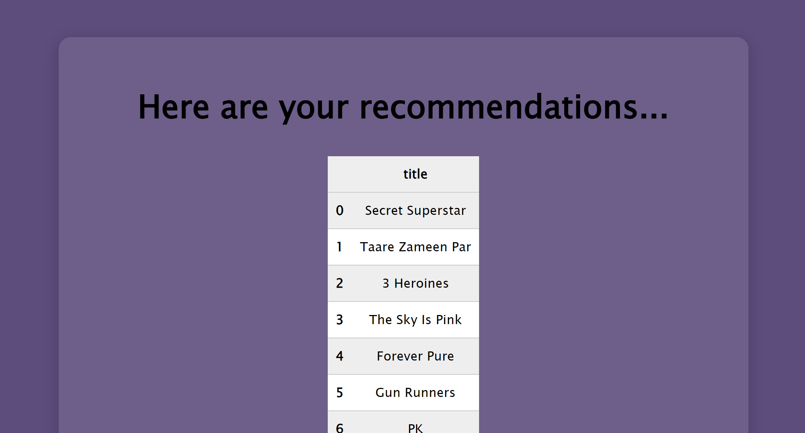

"# Movie-Recommendation-System"
"# Netflix Dataset"

A flask web-app which can be used to get recommendations for a tv-show/movie, the app recommends a list of media according to the input.

# System Screenshots

Here are some additional screenshots of the app:

### Home Screen

### Recommendations Screen

### Search Function Screen

